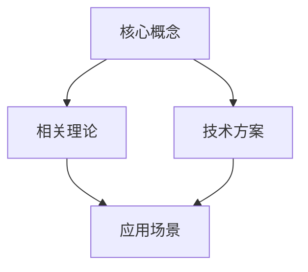
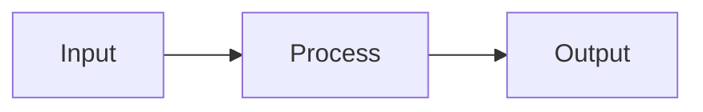
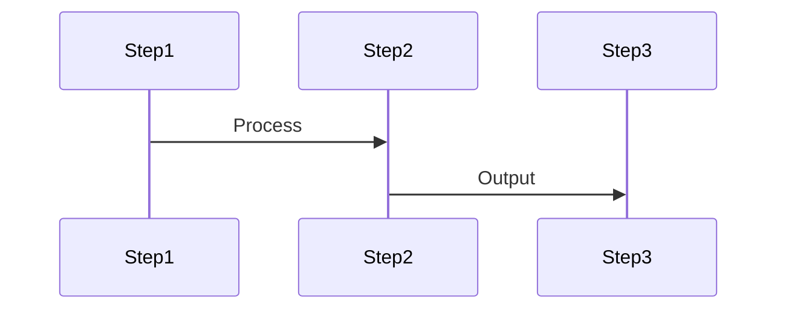

# 技术文档

## 1. 项目概述
HuggingPaper 是一个基于 GitHub + Docusaurus 的开源 AI 论文学习平台。我们专注于通过社区协作，将 AI 论文转化为易于理解的学习资源。

## 2. 技术架构

### 2.1 基础设施
- **GitHub**：代码和内容托管、版本控制、社区协作
- **GitHub Pages**：网站部署和托管
- **GitHub Actions**：自动化构建和部署
- **Docusaurus**：文档网站框架 (v3.7.0)
  - TypeScript + React
  - MDX支持
  - 全文搜索
  - 多语言支持
  - 版本管理

### 2.2 内容组织
- **目录结构**
```
huggingpaper/
├── docs/                    # 论文解读文档
│   ├── getting-started/     # 入门指南
│   ├── papers/             # 论文解读
│   │   ├── cv/            # 计算机视觉
│   │   ├── nlp/           # 自然语言处理
│   │   └── ml/            # 机器学习
│   └── concepts/           # 核心概念
├── src/                    # 网站源码
├── static/                 # 静态资源
└── docusaurus.config.js    # 站点配置
```

- **文档格式**：Markdown + MDX
  - 支持数学公式（KaTeX）
  - 支持代码高亮
  - 支持交互式组件

### 2.3 工作流程
- **内容贡献**
  1. Fork 仓库
  2. 创建分支
  3. 添加/修改内容
  4. 提交 Pull Request
  5. 社区审核
  6. 合并更新

- **质量控制**
  - Markdown lint
  - 链接检查
  - 格式验证
  - 社区审核

### 2.4 自动化流程
- **GitHub Actions**
  - 文档构建
  - 格式检查
  - 自动部署
  - 问题分配

### 2.4 增长系统

#### 2.4.1 数据分析
- **GitHub数据**
  - Stars和Forks趋势
  - Issues和PR统计
  - 贡献者活跃度
  - 通过GitHub API实现

- **访问分析**
  - Google Analytics集成
  - 页面访问统计
  - 来源追踪
  - 搜索关键词

#### 2.4.2 SEO优化
- **技术实现**
  - SSR/SSG支持
  - 动态站点地图
  - Meta标签管理
  - 性能优化

- **内容优化**
  - 关键词研究
  - URL结构
  - 内部链接
  - 图片优化

#### 2.4.3 社区运营
- **GitHub功能**
  - Discussions配置
  - Issue模板
  - PR模板
  - Wiki管理

- **社区指南**
  - 贡献指南
  - 行为准则
  - 审核标准
  - 最佳实践

## 3. 内容规范

### 3.1 论文解读模板
```markdown
---
id: paper-id
title: 论文标题
authors: [作者1, 作者2]
tags: [CV, 目标检测]
---

## 摘要速览
用200字以内通俗语言概括论文：
- 背景：研究领域和现有问题
- 挑战：待解决的具体难点
- 贡献：本文提出的创新解决方案

## 前置知识
- 必备基础：[链接到相关概念]
- 推荐资源：[补充学习材料]

## 核心拆解
### 1. 创新亮点
- 用图表展示核心创新
- 通过类比解释复杂概念
- 对比现有方法的优势

### 2. 技术方案
- 整体框架
  - 架构图解
  - 模块说明
  - 工作流程
- 关键算法
  - 算法原理
  - 实现细节
  - 优化策略

### 3. 难点攻克
- 数学推导
  - 公式解释
  - 步骤拆解
  - 直观理解
- 算法实现
  - 代码示例
  - 关键参数
  - 注意事项

## 实验与应用
### 1. 实验分析
- 实验设置
- 结果对比
- 消融研究

### 2. 应用案例
- 典型场景
- 实现效果
- 局限性
- 改进空间

## 可视化展示
### 1. 知识图谱


### 2. 技术框架


### 3. 算法流程


## 知识链接
- 相关概念
  - [概念1]：简要说明
  - [概念2]：简要说明
- 延伸阅读
  - 相关论文
  - 研究方向
  - 最新进展

## 社区互动
- 讨论区：[链接到GitHub Discussions]
- 问答解惑：[常见问题]
- 经验分享：[实践总结]
- 实践心得：[开发笔记]

## 参考资源
- 论文链接：[arXiv]()
- 代码实现：[GitHub]()
- 相关项目：[Demo]()
- 讨论交流：[Discussion]()
```

### 3.2 知识图谱
- 使用 Mermaid 绘制
- 展示概念关系
- 标注学习路径

### 3.3 版本控制
- 使用 Git 标签管理版本
- 重要更新记录 Changelog
- 历史版本访问

## 4. 社区协作

### 4.1 贡献指南
- 内容规范
- PR 流程
- 审核标准
- 协作礼仪

### 4.2 社区运营
- Issue 管理
- 讨论区使用
- 版本规划
- 社区活动

## 5. 数据来源

### 5.1 论文数据
- 来源：https://huggingface.co/api/daily_papers
- 更新：通过 GitHub Action 定时获取
- 人工筛选和整理

### 5.2 社区数据
- GitHub Issues
- Pull Requests
- Discussions
- Wiki

## 6. 部署说明

### 6.1 本地开发
```bash
# 克隆项目
git clone https://github.com/user/huggingpaper.git

# 安装依赖
npm install

# package.json
{
  "dependencies": {
    "@docusaurus/core": "3.7.0",
    "@docusaurus/preset-classic": "3.7.0",
    "@mdx-js/react": "^3.0.0",
    "clsx": "^2.0.0",
    "react": "^18.2.0",
    "react-dom": "^18.2.0"
  }
}

# 本地运行
npm start

# 构建
npm run build
```

### 6.2 生产部署
- 使用 GitHub Pages
- 通过 GitHub Actions 自动部署
- 使用自定义域名

## 1. 系统架构

### 1.1 仓库架构

#### 1.1.1 公开仓库 (huggingpaper)
- **主要内容**
  - 论文解读文档
  - 技术文档
  - 贡献指南
  - 社区规范
- **目标**
  - 开源社区协作
  - 知识共享
  - SEO优化
  - 提升影响力
- **分支策略**
  - main: 稳定版本
  - develop: 开发版本
  - feature/*: 新功能
  - docs/*: 文档更新

#### 1.1.2 私有仓库 (huggingpaper-internal)
- **核心资产**
  - 产品规划
  - 运营策略
  - 数据分析
  - 未发布内容
- **目标**
  - 保护核心资产
  - 内部协作
  - 敏感数据管理
  - 内容质量控制
- **分支策略**
  - main: 最新版本
  - draft/*: 草稿内容
  - review/*: 审核内容

#### 1.1.3 仓库同步
- **自动化工作流**
  - 内容发布流程
  - 质量检查
  - 格式验证
  - 链接检查
- **权限管理**
  - 公开仓库: 社区协作
  - 私有仓库: 团队成员
  - 审核机制: 双人复核
